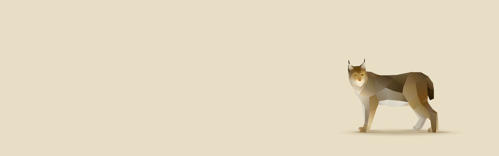

<h1 align="center">Synapses</h1>

<p align="center">
  <a href="https://www.apache.org/licenses/LICENSE-2.0">
    
  </a>
  <a href="https://www.npmjs.com/package/@nucleoidjs/synapses">
    
  </a>
  <a href="https://discord.com/invite/eWXFCCuU5y">
    
  </a>
</p>

[](http://nucleoid.com/)

<p align="center">
  Event-driven Alternative to React Context
</p>

<br/>

```shell
npm i @nucleoidjs/synapses
```

Synapses is an alternative to React Context with event-driven style that helps to build  loosely coupled components.

### How it works?

Subscribers are registered an event with `useEvent(eventType, initialValue)`, once publisher posts an event and its payload, and Synapses sends the event to subscribed components asynchronously and subscribed components will eventually be re-rendered with fresh data.


Example:
```javascript
const PublishComponent = () => {
  return (
      <button
          onClick={() => {
            const event = random(); // { number: 11, string: "red" }

            publish("BUTTON_CLICKED", event);
          }}
      >
        Button
      </button>
  );
};
```

```javascript
const Component1 = () => {
  const [event] = useEvent("BUTTON_CLICKED", { number: 10 });

  return <div>{event.number}</div>;
};
```

```javascript
const Component2 = () => {
  const [event] = useEvent("BUTTON_CLICKED", { string: "blue" });

  return <div>{event.string}</div>;
};
```


The complete sample project is [here](./sample).
