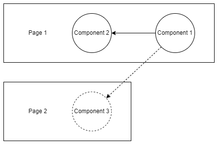

<h1 align="center">Synapses</h1>

<p align="center">
  <a href="https://www.apache.org/licenses/LICENSE-2.0">
    
  </a>
  <a href="https://www.npmjs.com/package/@nucleoidjs/synapses">
    
  </a>
  <a href="https://discord.com/invite/eWXFCCuU5y">
    
  </a>
</p>

[](http://nucleoid.com/)

<p align="center">
  Event-driven Alternative to React Context
</p>

<br/>

```shell
npm i @nucleoidjs/synapses
```

Synapses is an alternative to React Context with event-driven style that helps to build  loosely coupled components.

### How it works?

Subscribers are registered an event with `useEvent(eventType, initialValue)`, once publisher posts an event and its payload, and Synapses sends the event to subscribed components asynchronously and subscribed components will eventually be re-rendered with fresh data.


Example:
```javascript
import { publish } from "@nucleoidjs/synapses";

const PublishComponent = () => {
  return (
      <button
          onClick={() => {
            publish("BUTTON_CLICKED", { number: 11, string: "red" });
          }}
      >
        Button
      </button>
  );
};
```

```javascript
import { useEvent } from "@nucleoidjs/synapses";

const Component1 = () => {
  const [event] = useEvent("BUTTON_CLICKED", { number: 10 });

  return <div>{event.number}</div>;
};
```

```javascript
import { useEvent } from "@nucleoidjs/synapses";

const Component2 = () => {
  const [event] = useEvent("BUTTON_CLICKED", { string: "blue" });

  return <div>{event.string}</div>;
};
```


The complete sample project is [here](./sample).

### Stateless Handler

Synapses supports stateless components with caching last published payload for the event type, so that if the component is re-rendered, it won't lose the payload. For example, Component 3 in this example is not re-rendered yet, but Synapses holds the last payload for the event type, and once the component is rendered, it returns the payload instead of initial value.



## API

#### `const [ event ] = useEvent ( eventType , initialValue )`

React Hook is to subscribe an event. If there is no event posted yet, it returns `initialValue`, otherwise, returns last published payload for the event type from cache.

#### `publish ( eventType, payload )`

Publish function to post ane event and its payload.

#### `subscribe ( type , callback )`

Subscribe function acts like `useEvent` for non-React JavaScript.
