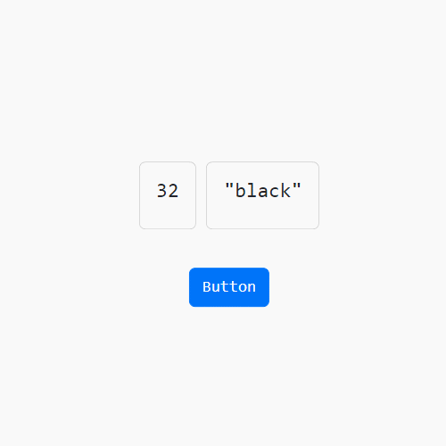
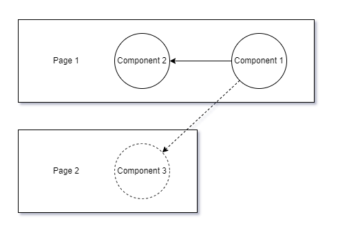

<h1 align="center">react-event</h1>

<p align="center">
  <a href="https://www.apache.org/licenses/LICENSE-2.0"></a>
  <a href="https://www.npmjs.com/package/@nucleoidai/react-event"></a>
  <a href="https://discord.com/invite/eWXFCCuU5y"></a>
</p>


<p align="center">
  Event-driven Alternative to React Context
</p>

<br/>

```shell
npm i @nucleoidai/react-event
```

react-event is an alternative to React Context with event-driven style communication that helps to build loosely coupled components.

### How it works?

Subscribers are registered an event with the custom hook `useEvent(eventType, initialValue)`, once publisher posts an event and its payload, react-event asynchronously sends the event to subscribed components and subscribed components will eventually be re-rendered with fresh data.

Example:

```javascript
import { useEvent } from "@nucleoidai/react-event";

const Component1 = () => {
  const [event] = useEvent("BUTTON_CLICKED", { number: 10 });

  return <div>{event.number}</div>;
};
```

```javascript
import { useEvent } from "@nucleoidai/react-event";

const Component2 = () => {
  const [event] = useEvent("BUTTON_CLICKED", { string: "blue" });

  return <div>{event.string}</div>;
};
```

```javascript
import { publish } from "@nucleoidai/react-event";

const PublishComponent = () => {
  return (
      <button
          onClick={() => {
            publish("BUTTON_CLICKED", { number: 11, string: "red" });
          }}
      >
        Button
      </button>
  );
};
```



The complete sample project is [here](./sample).

### Stateless Handling

react-event supports stateless components with caching last published payload for the event type, so that if the component is re-rendered, it won't lose the payload. For example, Component 3 in this example is not re-rendered yet, but react-event holds the last payload for the event type, and once the component is rendered, it returns the payload instead of initial value.



## Event-driven Architecture

Event-driven Architecture is commonly used in Microservices systems that pretty much targets similar problem; loose coupling. This style of architecture require middleware like Kafka, RabbitMQ etc. and we are trying to adopt the very same idea to React.js, of course with some modification such as "Stateless Handling".

## API

#### `const [ event ] = useEvent ( eventType , initialValue )`

React Hook is to subscribe an event. If there is no event posted yet, it returns `initialValue`, otherwise, returns last published payload for the event type from cache.

#### `publish ( eventType, payload )`

Publish function to post ane event and its payload.

#### `subscribe ( type , callback )`

Subscribe function acts like `useEvent` for non-React JavaScript.
